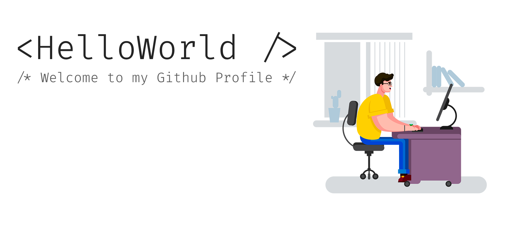

I'm Alexei, a Web Developer with a focus on front-end JavaScript, VueJS and the Jamstack. I create amazing websites and web apps to make the internet a better place.

The focus on the frameworks VueJS, Hugo, Node.

You will find my projects here. Welcome!

## 🔧 Technologies & Tools

## &#x1f4c8; GitHub Stats

## More from me

  <a href="https://zencod.ru">website</a> •
  <a href="https://t.me/alexsoin">telegram</a> •
  <a href="https://vk.com/alexsoin">vk</a> 

